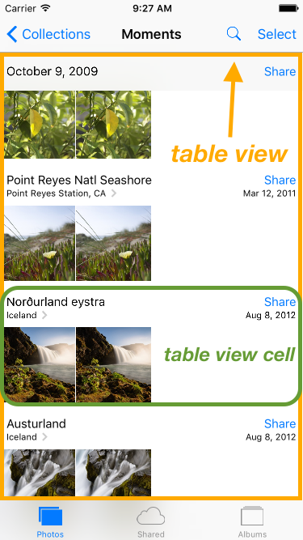
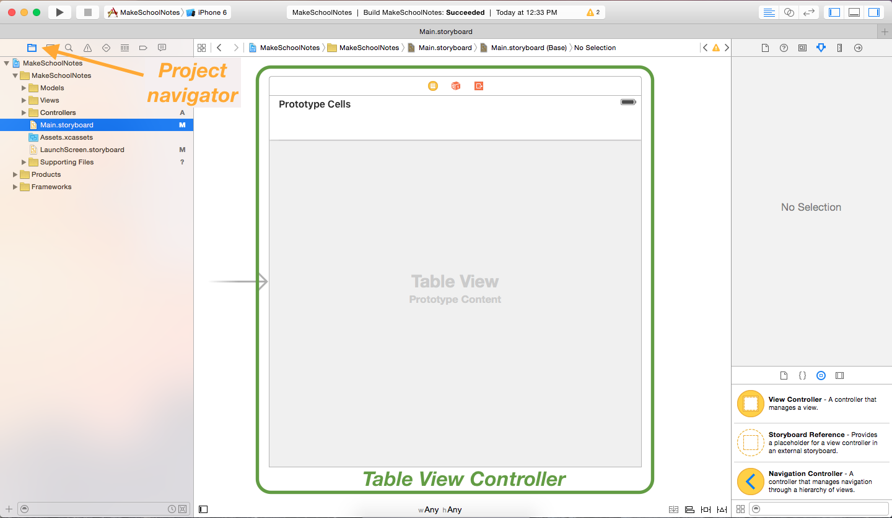
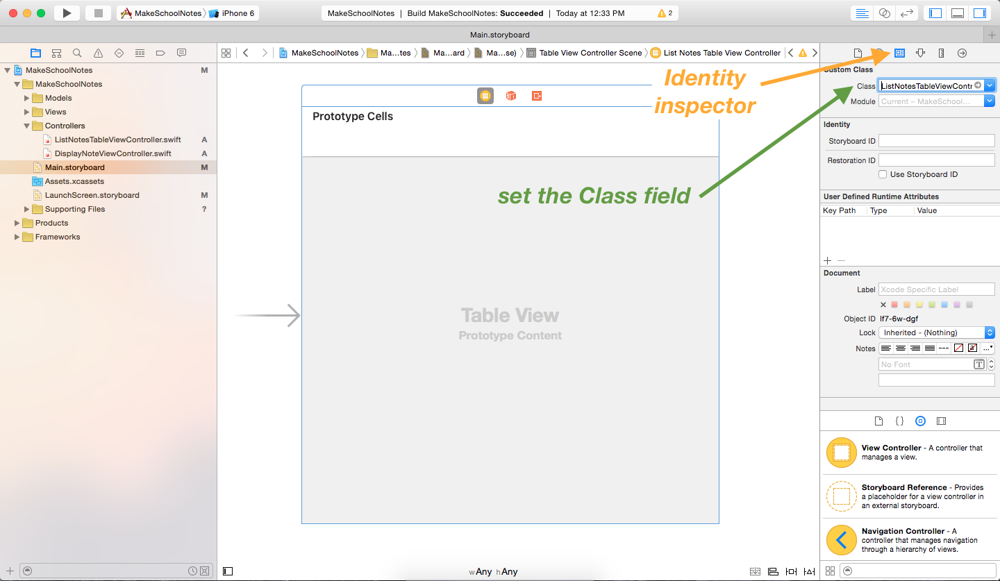
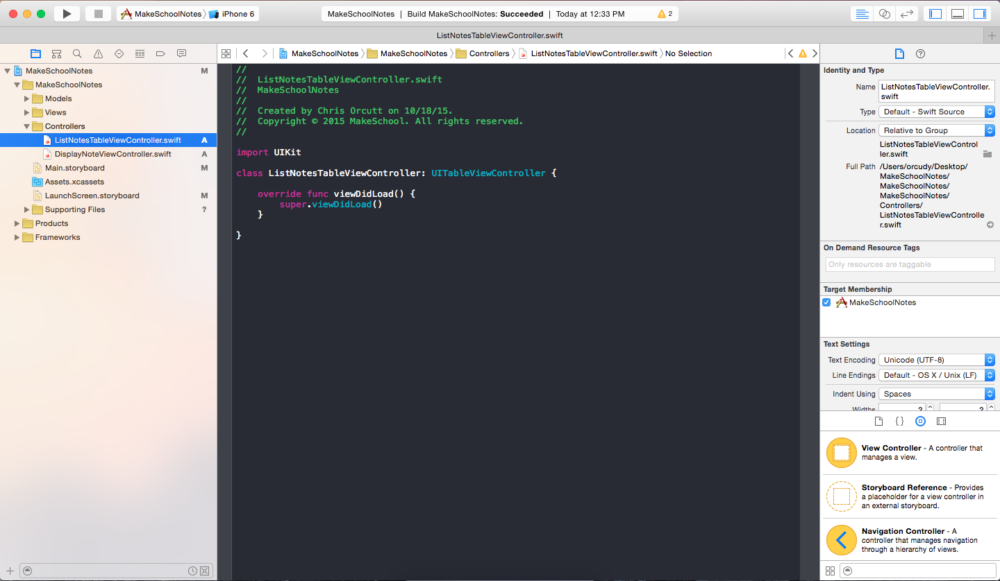
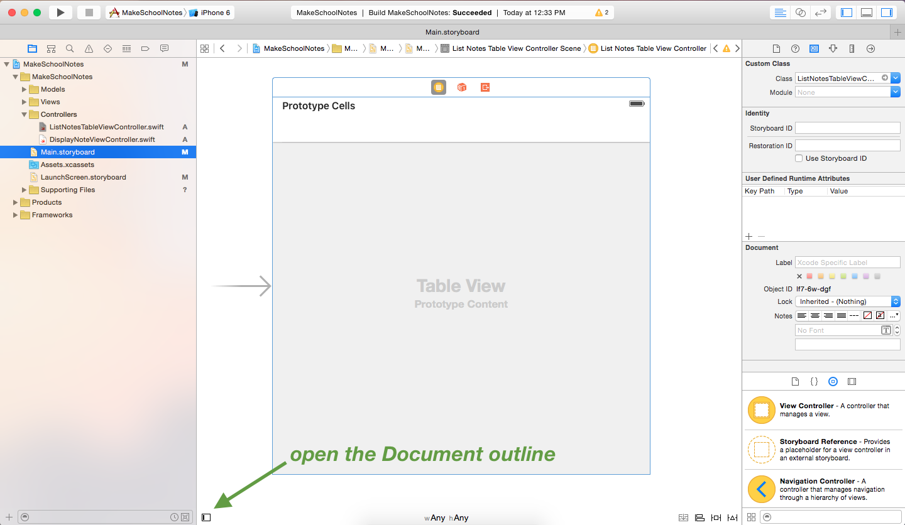
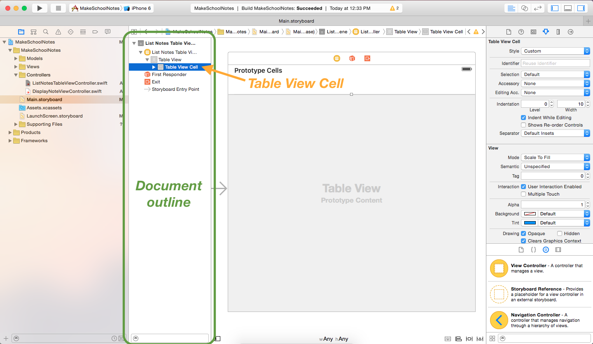
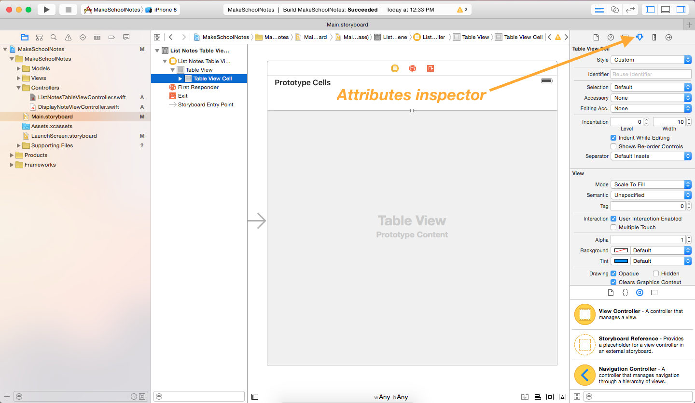
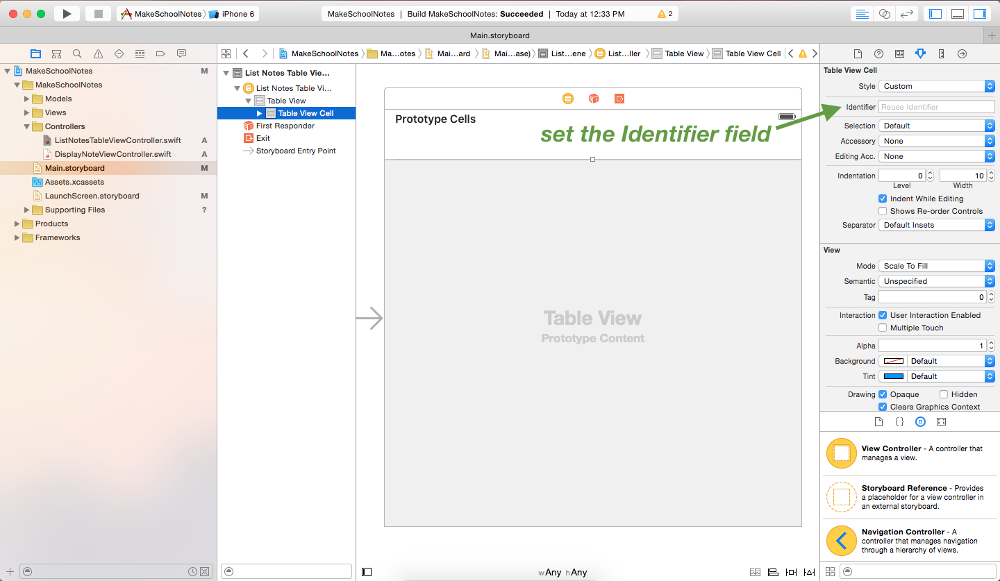
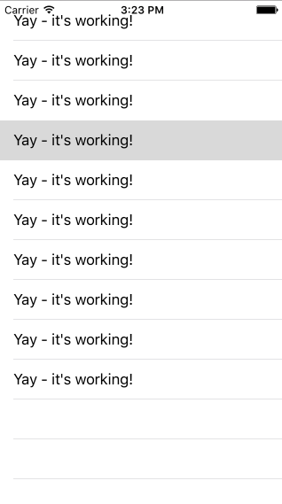

Table views are one of the most popular objects used in iOS development and can be found in many of the apps bundled with iOS: *Messages*, *Photos*, *Maps*, and many more! Table views use *cells* to display lists of information.

We can think of table views as regular views that have been given the ability to vertically scroll through content and select cells.

Table views are instances of the `UITableView` class and can be created in three ways:

1. Programmatically
2. Visually using Interface Builder
3. Using a *table view controller*.

(For more information on table views check out this [explanation--BROKEN LINK](link to table view discussion))

For the table view in Make School Notes, we will be using a *table view controller* as it is the easiest to get working.

The starter project that you downloaded earlier already contains a table view controller. Let's take a look at it now.

> [action]
Click the *Project navigator* icon, expand the *MakeSchoolNotes* folder, and select the `Main.storyboard` file:
>

##Introducing Table View Controllers

Table view controllers are the easiest way to use table views because they do a lot of the necessary table view setup for us. Table view controllers are instances of the `UITableViewController` class and, similar to table views, can be created programmatically or in Interface Builder.

Although the table view controller in the starter project was created in Interface Builder, we will want to manipulate it from code. This situation is very common when building iOS apps and to make the connection from our objects in Interface Builder to code, we use a feature of Xcode called *custom classes*. We want to set the custom class of our table view controller to *ListNotesTableViewController*. The *ListNotesTableViewController* class was included in the starter project and can be found in the `ListNotesTableViewController.swift` file.

> [action]
Setup the code connection by selecting the table view controller in your storyboard, clicking the *Identity inspector* icon, and setting the *Class* field to "ListNotesTableViewController". (Note that when you have successfully selected the table view controller, it will be outlined in blue.)
>

Now that we have set the custom class of our table view controller, we will be able to programmatically make changes to our table view controller from inside the *ListNotesTableViewController* class.

> [action]
Click the *Project navigator* icon, expand the *Controllers* folder, and select the `ListNotesTableViewController.swift` file.
>

Currently, there is nothing interesting in this file, but we will change that soon!

## Displaying Information with our Table View

Table views have two components: the *functionality* and the *information*. The functionality (vertical scrolling and the ability to select cells) is provided for free by the table view. To inform our table view about which information to display, we must do some setup.

When displaying information, a table view *must* know two things:

1. Total number of cells
2. What information to display for each specific cell

Let's add the necessary code to our project; we will discuss it afterwards.

> [action]
Add these two methods under the declaration of the *ListNotesTableViewController* class:
>
    // 1
    override func tableView(tableView: UITableView, numberOfRowsInSection section: Int) -> Int {
      return 10
    }
>   
    // 2
    override func tableView(tableView: UITableView, cellForRowAtIndexPath indexPath: NSIndexPath) -> UITableViewCell {
      // 3
      let cell = tableView.dequeueReusableCellWithIdentifier("listNotesTableViewCell", forIndexPath: indexPath)
>   
      // 4
      cell.textLabel?.text = "Yay - it's working!"
>
      // 5
      return cell
    }

So what exactly is happening in the code above?

1. We use this method to tell our table view how many cells it should display. (Usually this is set to the number of elements in an array, but for now we will use the value 10 for demonstration.)

2. We use this method to tell the table view what information it should display for a specific cell using the cell's *indexPath*. The index path of a cell tells us which *section* and *row* that specific cell belongs to within the table view. Currently, our table view has 1 section (the default value) and 10 rows.

3. This line is fetching the actual cell which will be displayed in the table view. The identifier, "noteTableViewCell" in our case, is a unique name that we give to the *prototype cell* of a table view in our storyboard in Interface Builder. After setting the identifier, we can reference the cell in code using the identifier. (We will set the identifier for our cell in the next step.)

4. We are setting the `text` property of our cell to "Yay - it's working!". Note that our cell has type `UITableViewCell` and that the `text` property is a property of a `UITableViewCell`.

5. We return the cell to be used within the table view.

## Setting the Identifier

Before we can run our program, we need to set the identifier of the prototype cell in our storyboard:

1. Open the *Document Outline*.

  

2. Select the *Table View Cell*.

  

3. Click the *Attributes inspector*.

  

4. Enter "listNotesTableViewCell" into the *identifier* field.

  

Notice that when we changed the *identifier* of the cell to "listNotesTableViewCell", the name of the cell in the *Document Outline* changed from "Table View Cell" to "listNotesTableViewCell".

#Running the App!

Now when you run the program you should see something like this:

Congratulations - You have just successfully setup a table view controller! In the next tutorial we will customize our table view cells so that we can actually display our note's title and modification time.
