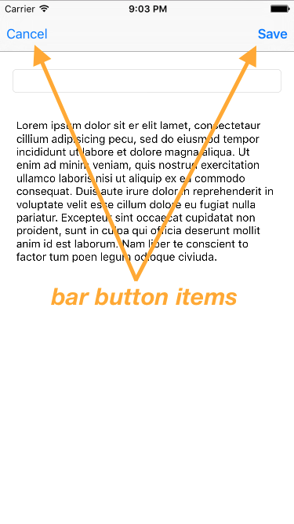
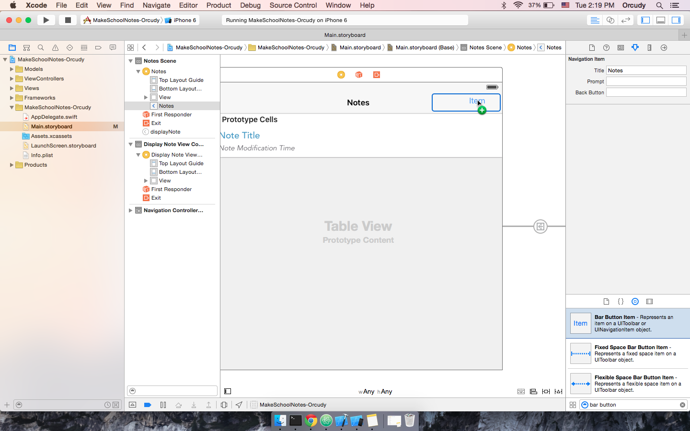
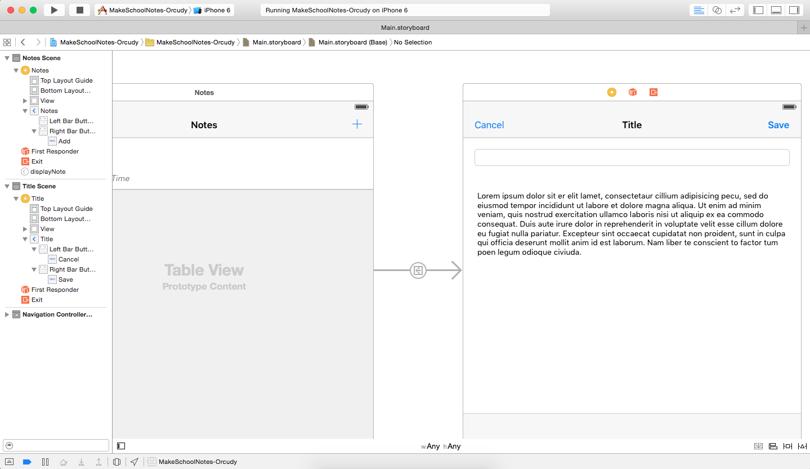
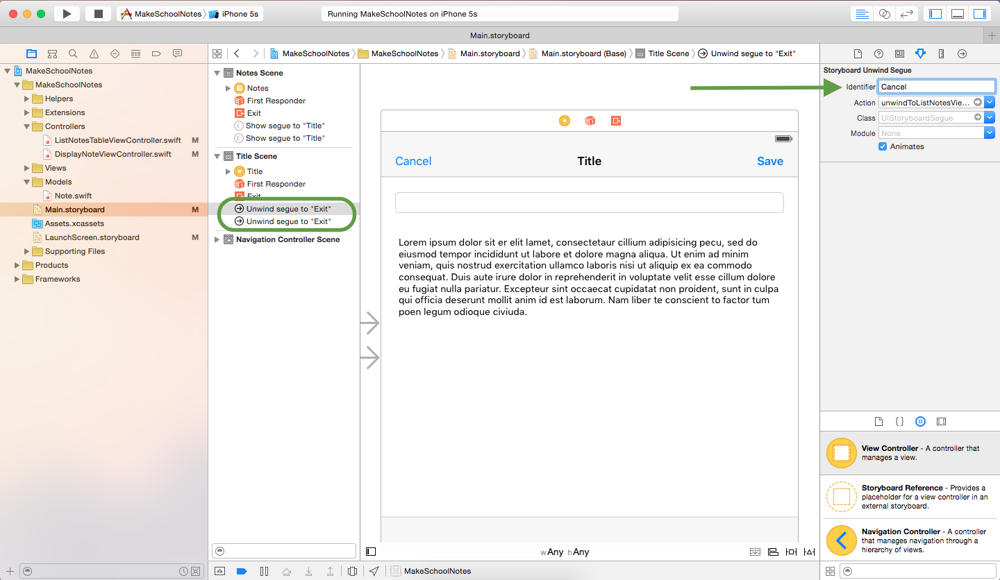

The basic interface of our app is nearly finished! Only one more step to go and then we are on to implementing our app's logic.

# Introducing Bar Button Items

*Bar button items* are special buttons that function the same way as normal buttons, but can be placed inside a navigation bar.

In Make School Notes we want our users to be able to add new notes, remove old notes, and edit the content or title of any note. To enable our note adding and editing functionality (we will add note removal in a later tutorial), we are going to use three bar button items :

  1. A **+** button on the top right of the *List Notes View Controller* so that users can add new notes.
  2. A **Save** button on the top right of the *Display Note View Controller* so that users can save their changes after modifying or creating a note.
  3. A **Cancel** button on the top left of the *Display Note View Controller* so that users can discard their changes after modifying a note.

Before adding bar button items to a navigation bar, we must first ensure that the navigation bar has a *navigation item*. Notice that the *Notes View Controller* contains a navigation item (which was created by default when we added the navigation controller) and that the *Display Note View Controller* does not.

Let's add a Navigation Item to the *Display Notes View Controller* now.

> [action] Drag a *Navigation Item* from the Object library to the *Display Notes View Controller* in your storyboard.

Great! Now that both of our view controllers have Navigation items, we can easily add our bar button items.

> [action] Select the *List Notes View Controller* from the Document Outline and drag a *Bar Button Item* from the Object library to the right side of the navigation bar.
>

Now let's change the style of our bar button item so that it looks like a **+** (add symbol).

> [action] Select the bar button item, click the Attributes inspector icon, and set the *System Item* field to *Add*.

Now that you know how to add and customize bar button items, try adding the Cancel and Save bar button items to the *Display Note View Controller* on your own.

>[action] Add the Cancel and Save bar button items to the left and right of the *Display Note View Controller* respectively. The result should look like this:
>

Great! We have successfully added the necessary bar buttons items for Make School Notes! However, if you tried clicking the + button you would notice that is doesn't do anything. Let's fix that by creating a new segue from the + button to the *Display Note View Controller*.

>[action] Create a *show* segue from the + button to the *Display Note View Controller*. Set the segue identifier to "addNote".
>
(Remember that when we want to create segues, all we have to do is `Control-click` from an object in our storyboard to a view controller!)
>
Also, update the `prepareForSegue()` method in the List Notes View Controller as follows:
>
    override func prepareForSegue(segue: UIStoryboardSegue, sender: AnyObject?) {
      if let identifier = segue.identifier {
        if identifier == "displayNote" {
          print("Table view cell tapped")
        } else if identifier == "addNote" {
          print("+ button tapped")
        }
      }
    }

The code above is identical to our previous code with the exception that we have added an `else if` statement to check when the **+** button is tapped.

Now when you tap the **+** button the Display Note View Controller scene should appear. We would like to trigger segues when we tap the *Cancel* and *Save* buttons as well; however, we must use a special type of segue for these buttons called an *unwind segue*.

# Introducing Unwind Segues

Unwind segues are used to undue transitions that were triggered by other segues. For instance, if we had used a segue to get from view controller A to view controller B, we could use an unwind segue to undue that segue, thus taking us from view controller B back to view controller A.

In the above example, if we *didn't* use unwind segues (i.e. we used a regular segue) when transitioning from view controller B back to view controller A, we would create a new instance of view controller A. (Which means we would have two instances of view controller A and one instance of view controller B.) If we then transitioned back to view controller B, we would once again create a new instance, this time of view controller B. (Which means we would then have two instances of both view controllers.) If we kept transitioning back and forth between the view controllers, we would continue to create new instances of both view controllers - this is called a *memory leak* and can lead to your app crashing! We use unwind segues when transitioning between view controllers to avoid memory leaks.

To create an unwind segue we must do two things:

1. Create an unwind segue method in the view controller that you want to end up in after executing the unwind segue. (If you wanted to unwind from view controller B to view controller A, you would put your unwind segue method in view controller A.)

2. Connect an action to the unwind segue.

For Make School Notes, when our users are in the Display Note View Controller and they tap either the **Cancel** or **Save** buttons, we want to execute an unwind segue back to the List Notes View Controller.

To accomplish this we must first setup the unwind segue method in the List Notes View Controller class.

>[action] Select the `ListNotesViewController.swift` file and add the following method:
>
    @IBAction func unwindToListNotesViewController(segue: UIStoryboardSegue){
>
      // for now, simply defining the method is sufficient.
      // we'll add code later
>
    }

Next, we need to connect our **Cancel** and **Save** buttons to the unwind segue.

>[action] `Control-drag` from the **Cancel** button (and **Save** button) to the *Exit icon* and select `unwindToListNotesViewController` when prompted.
>
<video width="100%" controls>
    <source src="https://s3.amazonaws.com/mgwu-misc/Make+School+Notes/connectToExit.mov" type="video/mp4">
</video>

# Adding Unwind Segue Identifiers

Unlike regular segues, unwind segues are only accessible from the Document outline. Also, there is no easy way to identify which button corresponds to which segue. Thus we must use the guess-and-check method when setting the identifier of unwind segues.

> [action]
Select the top  *Unwind segue to "Exit"* segue from the Document Outline, then in the Attributes inspector set its *Identifier* field to "Cancel". (Set the other segue's identifier to "Save".)
>
 

 To ensure that we have assigned the correct identifier to each unwind segue, we will test each button.

 > [action]
 Add the following to the Display Note View Controller class:
 >
     override func prepareForSegue(segue: UIStoryboardSegue, sender: AnyObject?) {
      if let identifier = segue.identifier {
        if identifier == "Cancel" {
          print("Cancel button tapped")
        } else if identifier == "Save" {
          print("Save button tapped")
        }
      }
    }

The code above is identical to the code we added in the `prepareForSegue()` method in the List Notes View Controller.

# Running the App!

Now when you run your app each segue should print the correct message to the screen like this:

<video width="100%" controls>
    <source src="https://s3.amazonaws.com/mgwu-misc/Make+School+Notes/P06-complete.mov" type="video/mp4">
</video>

If you notice that the messages printed to the console do not match with the buttons you are tapping, you should change the identifiers of the mismatched segues.

Congratulations! We have finished building the interface of Make School Notes! In the next tutorial we will start programming the logic. =]
