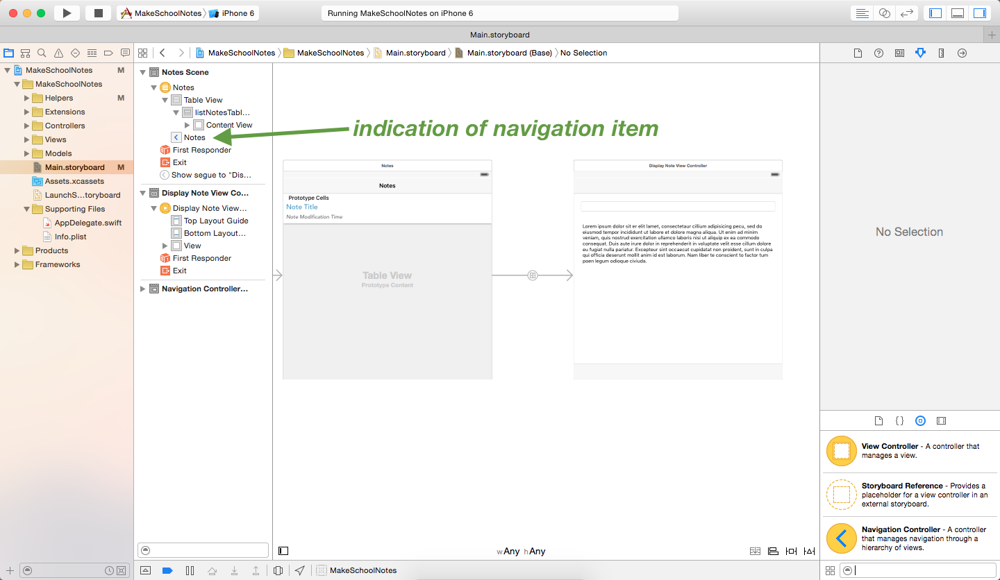

The basic interface of our app is nearly finished! Only one more step to go and then we are on to implementing our app's logic.

## Introducing Bar Button Items

*Bar button items* are special buttons that function the same way as normal buttons, but can be placed inside a navigation bar.

In **Make School Notes** we want our users to be able to add new notes, remove old notes, and edit the content or title of any note. To enable our note adding and editing functionality (we will add note removal in a later tutorial), we are going to use three bar button items :

  1. A **+** button on the top right of the *Notes Scene* so that users can add new notes.
  2. A **Save** button on the top right of the *Display Note View Controller Scene* so that users can save their changes after modifying or creating a note.
  3. A **Cancel** button on the top left of the *Display Note View Controller Scene* so that users can discard their changes after modifying a note.

Before adding bar button items to a navigation bar, we must first ensure that the navigation bar has a *Navigation item*. Notice that the *Notes View Controller* contains a Navigation item (which was created by default when we added the navigation controller) and that the *Display Note View Controller* does not.

Let's add a Navigation item to the *Display Notes View Controller* now.

> [action] Drag a *Navigation item* from the Object library to the *Display Notes View Controller* in your storyboard.

Great! Now that both of our view controllers have Navigation items, we can easily add our bar button items.

> [action] Select the *Notes View Controller* from the Document Outline and drag a *Bar Button Item* from the Object library to the right side of the navigation bar.
>

Now let's change the style of our bar button item so that it looks like a **+** (add symbol).

> [action] Select the bar button item, click the Attributes inspector icon, and set the *System Item* field to *Add*.

Now that you know how to add and customize bar button items, try adding the Cancel and Save bar button items to the *Display Note View Controller* on your own.

>[action] Add the Cancel and Save bar button items to the left and right of the *Display Note View Controller* respectively. The result should look like this:
>

Great! We have successfully added the necessary bar buttons items for **Make School Notes**! However, if you tried clicking the + button you would notice that is doesn't do anything. Let's fix that by creating a new segue from the + button to the *Display Note View Controller*.

>[action] Create a *show* segue from the + button to the *Display Note View Controller*. (Remember that when we want to create segues, all we have to do is `CNTR-click` from an object in our storyboard to a view controller!)

When you tap the **+** button the Display Note View Controller scene should appear; however, notice that when you tap the **Cancel** button nothing happens! To fix this problem we will have to use what is known as an *unwind segue*!

## Introducing Unwind Segues

Unwind segues are used to undue transitions that were triggered by other segues. For instance, if we had used a segue to get from view controller A to view controller B, we could use an unwind segue to undue that segue, thus taking us from view controller B back to view controller A.

In the above example, if we were to use a regular segue when transitioning from view controller B back to view controller A, we would actual be creating a new instance of view controller A. (Which means we would have two instances of view controller A and one instance of view controller B.) If we then transitioned back to view controller B, we would once again create a new instance of view controller B. (Which means we would then have two instances of both view controllers.) If we kept transitioning back and forth between the view controllers, we would continue to create new instances of both view controllers - this is called a *memory leak* and can lead to your app crashing! We use unwind segues when transitioning between view controllers to avoid memory leaks.

To create an unwind segue we must do two things:

1. Create an unwind segue method in the view controller that you want to end up in after executing the unwind segue. (If you wanted to unwind from view controller B to view controller A, you would put your unwind segue method in view controller A.)

2. Connect an action to the unwind segue.

For **Make School Notes**, when our users are in the Display Note View Controller and they tap either the **Cancel** or **Save** buttons, we want to execute an unwind segue back to the Notes View Controller.

To accomplish this we must first setup the unwind segue method in the List Notes View Controller class.

>[action] Select the `ListNotesViewController.swift` file and add the following method:
>
    @IBAction func unwindToListNotesViewController(segue: UIStoryboardSegue){
>
      // for now, simply defining the method is sufficient.
      // we'll add code later
>
    }

Next, we need to connect our **Cancel** and **Save** buttons to the unwind segue.

>[action] `CNTR-drag` from the **Cancel** button (and **Save** button) to the *Exit icon* and select `unwindToListNotesViewController` when prompted.
>

## Running the App!

Congratulations -- we have finished building the interface of **Make School Notes**! Your app should look similar to this:

In the next tutorial we will start programming the logic of our app. =]
